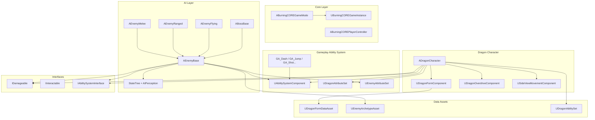

# BurningCORE — Technical Architecture

> **Тип:** 3D side-scrolling action platformer  
> **Движок:** Unreal Engine 5.6 (`.uproject`), правила орієнтовані на UE 5.7  
> **Мова:** C++ (PCH: Explicit), Blueprints тільки для layout/визуалів  
> **Платформа:** PC (Windows)  
> **Управління:** Клавіатура + миша (WASD, Space, Shift, ЛКМ/ПКМ)  
> **Перспектива:** Вид від третьої особи збоку (90° до напрямку руху)  
> **Рух:** переважно зліва направо  

---

## 1. Модуль & Залежності

Проект має **єдиний C++ модуль** — `BurningCORE`.

### Build.cs — Публічні залежності

| Категорія | Модулі |
|---|---|
| **Core** | `Core`, `CoreUObject`, `Engine`, `InputCore` |
| **Input** | `EnhancedInput` |
| **AI** | `AIModule`, `StateTreeModule`, `GameplayStateTreeModule` |
| **GAS** | `GameplayAbilities`, `GameplayTags`, `GameplayTasks` |
| **UI** | `UMG`, `Slate`, `SlateCore` |
| **VFX** | `Niagara` |

### .uproject — Плагіни

| Плагін | Призначення |
|---|---|
| `StateTree` | Дерева станів для AI |
| `GameplayStateTree` | Інтеграція StateTree з Gameplay |
| `GameplayAbilities` | Gameplay Ability System (GAS) |
| `ModelingToolsEditorMode` | Інструменти моделювання (Editor-only) |

---

## 2. Production Structure

Проект перейшов на production-first структуру.  
Активний gameplay path проходить через `Core + Character + GAS + AI + Systems + Platformer + UI`, а platformer shell-класи тепер зібрані в `Platformer/Base` та `Platformer/Camera`.

```
Source/BurningCORE/
│
├── Core/                             ← Фреймворк рівня гри
│   ├── BurningCOREGameMode           ← checkpoint-система, boss encounters, respawn
│   ├── BurningCOREGameInstance        ← save/load, глобальний стан між рівнями
│   ├── BurningCOREPlayerController    ← shared controller base
│   ├── BurningCOREGameState           ← стан гри
│   ├── BurningCOREPlayerState         ← стан гравця
│   └── UI/MainMenu/                   ← головне меню
│
├── Character/                         ← Головний герой (Dragon)
│   ├── DragonCharacter                ← ADragonCharacter (GAS, Damageable, форми)
│   ├── DragonFormComponent            ← перемикання форм (FormRegistry, GameplayTags)
│   ├── DragonOverdriveComponent       ← ресурс Overdrive (заповнення, активація, дренаж)
│   └── SideViewMovementComponent      ← компонент руху для side-view
│
├── GAS/                               ← Gameplay Ability System
│   ├── DragonAbilitySet               ← DataAsset зі списком Abilities & Effects
│   ├── Abilities/                     ← Конкретні GameplayAbility
│   │   ├── GA_Dash, GA_Jump
│   │   ├── GA_DragonBaseShot, GA_DragonChargeShot
│   │   ├── GA_FormSwitch, GA_OverdriveActivate
│   │   └── GA_HitReaction
│   └── Attributes/
│       ├── DragonAttributeSet         ← Health, OverdriveEnergy, BaseDamage, ChargeMultiplier
│       └── EnemyAttributeSet          ← аналог для ворогів
│
├── AI/                                ← Система ворогів
│   ├── EnemyBase                      ← abstract (GAS + StateTree + AIPerception + Damageable)
│   ├── EnemyMelee, EnemyRanged, EnemyFlying  ← спеціалізовані типи
│   └── BossBase                       ← базовий клас босів
│
├── Combat/                            ← Снаряди
│   ├── DragonProjectile               ← снаряд гравця
│   └── EnemyProjectile                ← снаряд ворога
│
├── Data/                              ← Data-Driven Assets
│   ├── DragonFormDataAsset            ← конфігурація форми (проджектайли, статуси, візуали, Niagara)
│   └── EnemyArchetypeAsset            ← конфігурація типу ворога (статси, AI StateTree, abilities)
│
├── Interfaces/                        ← UINTERFACE
│   ├── IDamageable                    ← ApplyDamage(GAS Spec), IsAlive()
│   └── IInteractable                  ← для інтерактивних об'єктів
│
├── Systems/                           ← Ігрові системи
│   ├── BurningCORESaveGame            ← збереження (прогрес, чекпоінти, форми, апгрейди, секрети)
│   └── CheckpointActor                ← маркер чекпоінту на рівні
│
├── Platformer/                        ← Production platformer layer
│   ├── Character/
│   │   ├── PlayableDragonCharacter    ← production pawn поверх ADragonCharacter
│   │   └── PlatformerInteractable     ← platformer interaction contract
│   └── Environment/
│       ├── PlatformerJumpPad          ← jump pad actor
│       ├── PlatformerMovingPlatform   ← moving platform actor
│       ├── PlatformerPickup           ← pickup actor
│       └── PlatformerSoftPlatform     ← one-way / drop-through platform
│
├── UI/                                ← Runtime gameplay UI
│   ├── PlatformerUI                   ← platformer HUD widget
│   └── PauseMenu/                     ← pause/settings widgets
│
├── Platformer/Base/                   ← Framework shell для platformer mode
│   ├── PlatformerGameMode             ← GameMode для рівнів
│   └── PlatformerPlayerController     ← PlayerController для platformer flow
└── Platformer/Camera/                 ← Camera shell
    └── PlatformerCameraManager        ← кастомний менеджер камери
```

---

## 3. Gameplay Ability System (GAS)

### 3.1 Інтеграція

- `ADragonCharacter` та `AEnemyBase` реалізують `IAbilitySystemInterface`.
- Обидва класи мають `UAbilitySystemComponent` + відповідний `UAttributeSet`.
- Damage передається через `FGameplayEffectSpecHandle` (інтерфейс `IDamageable`).

### 3.2 Атрибути гравця (`UDragonAttributeSet`)

| Категорія | Атрибут |
|---|---|
| **Vitals** | `Health`, `MaxHealth` |
| **Overdrive** | `OverdriveEnergy`, `MaxOverdriveEnergy` |
| **Combat** | `BaseDamage`, `ChargeMultiplier` |
| **Meta** | `IncomingDamage` (пре-процесинг) |

Є override'и `PreAttributeChange` та `PostGameplayEffectExecute` для clamping та reaction logic.

### 3.3 Здібності (Abilities)

| Ability | Опис |
|---|---|
| `GA_Dash` | Ривок / уникання |
| `GA_Jump` | Стрибок (GAS-based) |
| `GA_DragonBaseShot` | Базовий постріл |
| `GA_DragonChargeShot` | Заряджений постріл |
| `GA_FormSwitch` | Перемикання форми |
| `GA_OverdriveActivate` | Активація Overdrive-режиму |
| `GA_HitReaction` | Реакція на отримання удару |

### 3.4 Data-Driven Abilities

`UDragonAbilitySet` (DataAsset) — містить масиви `FDragonAbilitySet_Ability` та `FDragonAbilitySet_Effect`. Призначається на `ADragonCharacter` через `DefaultAbilitySet` і завантажується в `BeginPlay`.

---

## 4. Система форм (Dragon Form System)

Персонаж має кілька **бойових форм**, кожна з яких визначається `UDragonFormDataAsset`:

| Поле | Тип | Опис |
|---|---|---|
| `FormTag` | `FGameplayTag` | Ідентифікатор форми |
| `ProjectileClass` | `TSubclassOf<ADragonProjectile>` | Базовий снаряд |
| `ChargeProjectileClass` | `TSubclassOf<ADragonProjectile>` | Заряджений снаряд |
| `OnHitStatusEffect` | `TSubclassOf<UGameplayEffect>` | Ефект при попаданні |
| `StatusStacksPerHit` / `StatusThreshold` | `int32` | Система стеків статус-ефектів |
| `OverdriveProjectileClass` | `TSubclassOf<ADragonProjectile>` | Снаряд в Overdrive |
| `OverdriveDamageMultiplier` | `float` | Множник урону Overdrive |
| `ChargeTime` | `float` | Час зарядки |
| `CharacterOverlayMaterial` | `UMaterialInterface*` | Візуальний оверлей |
| `FormColor` | `FLinearColor` | Колір форми |
| `FormAuraVFX` | `UNiagaraSystem*` | VFX аура (Niagara) |

**`UDragonFormComponent`** — управляє активною формою через `FormRegistry` (`TMap<FGameplayTag, UDragonFormDataAsset*>`).

---

## 5. Overdrive System

`UDragonOverdriveComponent` — ресурсний компонент:

- **Заповнення**: `AddOverdriveEnergy()` — додає енергію (від вбивства ворогів, `OverdriveEnergyDrop` з `EnemyArchetypeAsset`)
- **Активація**: `TryActivateOverdrive()` — перевіряє поріг (`ActivationThreshold`)
- **Дренаж**: Tick-based (`DrainRate` одиниць/сек)
- **Делегат**: `OnOverdriveStateChanged` — для UI та VFX реакцій

---

## 6. AI система

### Стек технологій
- **StateTree** (замість BehaviorTree) — основна поведінкова модель
- **GameplayStateTree** — інтеграція StateTree з Gameplay Framework
- **AIPerception** — для detection/awareness
- **EQS** (Environment Query System) — для пошуку позицій

### Ієрархія ворогів

```
AEnemyBase (abstract)
├── AEnemyMelee    — ближній бій
├── AEnemyRanged   — дальній бій (EnemyProjectile)
├── AEnemyFlying   — літаючий ворог
└── ABossBase      — базовий клас босів
```

Кожен ворог конфігурується через **`UEnemyArchetypeAsset`**:
- `BaseHealth`, `BaseDamage`, `MoveSpeed` — базові характеристики
- `BehaviorTree` (`UStateTree*`) — поведінка
- `Abilities` — масив `TSubclassOf<UGameplayAbility>`
- `CurrencyDrop`, `OverdriveEnergyDrop` — нагороди
- `Immunities` — масив `FGameplayTag` імунітетів

---

## 7. Input System

Використовується **Enhanced Input** з паттерном `Do*()`:

```cpp
// Обробник InputAction
void Move(const FInputActionValue& Value) { DoMove(Value.Get<FVector2D>().X, ...); }

// Публічний метод — може викликатись з UI, AI, або напряму
UFUNCTION(BlueprintCallable)
virtual void DoMove(float Right, float Forward);
```

**Input Actions** (визначені як `UInputAction*` UPROPERTY):
- `MoveAction` — рух (WASD)
- `JumpAction` — стрибок (Space)
- `LookAction` / `MouseLookAction` — погляд

Додаткові дії для GAS abilities (Dash, Attack, FormSwitch) біндяться у production pawn-класах поверх `ADragonCharacter`.

---

## 8. Camera System

- **Character**: `USpringArmComponent` + `UCameraComponent` на `ADragonCharacter`
- **Platformer**: `PlatformerCameraManager` — кастомний менеджер камери для side-view (90° відносно напрямку руху)
- Камера фіксована збоку (2.5D perspective)

---

## 9. Level Flow & Persistence

### GameMode (`ABurningCOREGameMode`)
- `RespawnPlayerAtCheckpoint()` — респаун на останньому чекпоінті
- `ActivateBossEncounter(Boss)` — запуск boss fight
- `OnLevelCompleted()` — логіка завершення рівня
- `RegisterCheckpoint(Checkpoint)` — реєстрація чекпоінтів

### Save System
- `UBurningCOREGameInstance` — керує `SaveProgress()` / `LoadProgress()`
- `UBurningCORESaveGame` → `FPlayerProgressionData`:
  - `UnlockedRegions` / `LevelStates` (Locked → Unlocked → Completed → Perfected)
  - `UnlockedForms`, `PurchasedUpgrades`, `CollectedSecrets`
  - `UpgradeCurrency`, `TotalDeaths`
  - `LastCheckpoint` (tag + level name)

### Level Structure
- Головне меню (MainMenu level + `MainMenuGameMode`)
- До 20 ігрових рівнів (окремі `.umap`)
- Level selection через `MainMenuWidget`

---

## 10. UI система

| Шар | Технологія | Опис |
|---|---|---|
| **C++ Base** | `UUserWidget` | Базові класи віджетів у C++ |
| **BP Layout** | UMG (Blueprint Widgets) | Візуали та анімації в Blueprint |
| **Slate** | `Slate` / `SlateCore` | Для кастомних елементів |

### Наявні UI компоненти
- `UI/` — runtime HUD і pause/settings widgets
- `Core/UI/MainMenu/` — головне меню з вибором рівнів

---

## 11. Interfaces (UINTERFACE)

| Інтерфейс | Методи | Де реалізований |
|---|---|---|
| `IDamageable` | `ApplyDamage(GAS Spec, HitResult)`, `IsAlive()` | `DragonCharacter`, `EnemyBase` |
| `IInteractable` | (взаємодія) | Gameplay objects |
| `IPlatformerInteractable` | `Interaction(AActor*)` | Platformer environment / interactive actors |

---

## 12. Code Style & Conventions

### Правила

| Правило | Приклад |
|---|---|
| Forward declarations в `.h` | `class USpringArmComponent;` |
| `UPROPERTY` з `Category`, `meta` | `meta=(ClampMin=0, ClampMax=100)` |
| `UCLASS(abstract)` для базових класів | `ADragonCharacter`, `AEnemyBase` |
| `FORCEINLINE` для getter-ів | `FORCEINLINE UCameraComponent* GetFollowCamera() const` |
| Interface секції маркеровані | `// ~begin CombatAttacker interface` |
| PCH: Explicit | `PCHUsage = PCHUsageMode.UseExplicitOrSharedPCHs` |
| `TObjectPtr<>` для UPROPERTY | `TObjectPtr<UAbilitySystemComponent>` |
| Do*-паттерн для Input | `Move() → DoMove()`, `Jump() → DoJumpStart()` |

### Naming Conventions

| Тип | Формат | Приклад |
|---|---|---|
| Actor | `A` prefix | `ADragonCharacter` |
| Component | `U` prefix | `UDragonFormComponent` |
| Interface | `I` prefix | `IDamageable` |
| Struct | `F` prefix | `FCheckpointSaveData` |
| Enum | `E` prefix | `ELevelCompletionStatus` |
| GameplayAbility | `GA_` prefix | `GA_Dash`, `GA_Jump` |
| Log Category | `Log{Name}` | `LogTemplateCharacter` |

### Файлова структура

- Ім'я файлу = ім'я класу без UE-prefix (`DragonCharacter.h`)
- Platformer-специфічні класи залишають історичні імена, але живуть у `Platformer/*`
- Include order: matching .h → CoreMinimal → Engine → Project

---

## 13. Архітектурні рішення та обґрунтування

| Рішення | Причина |
|---|---|
| Production-first layering | Один активний gameplay path без дублювання pawn/controller stacks |
| UINTERFACE замість hard dependencies | Розв'язання зв'язків між підсистемами |
| GAS для abilities та damage | Стандартний UE підхід для combat-ігор з атрибутами |
| StateTree замість BehaviorTree | Вибір для UE 5.7+, більш сучасний підхід |
| DataAsset-driven конфігурація | Forms, Archetypes, AbilitySets — все через DataAsset |
| C++ base + BP derived | Логіка в C++, візуали/ассети в BP |
| EnhancedInput + Do*() | UI та AI можуть викликати ту ж логіку без InputAction |
| Niagara для VFX | Form auras, ефекти (замість Cascade) |
| GameplayTags для ідентифікації | Форми, чекпоінти, регіони, апгрейди — все через Tags |

---

## 14. Діаграма залежностей


